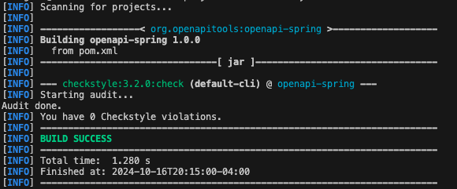
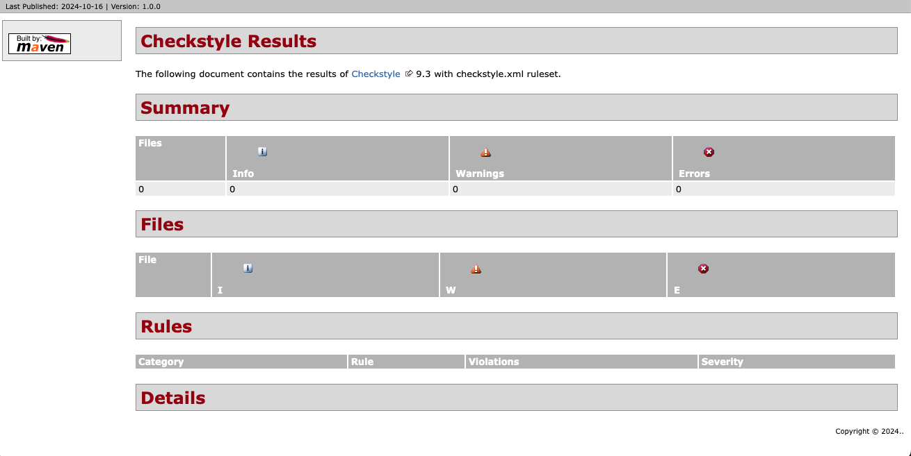
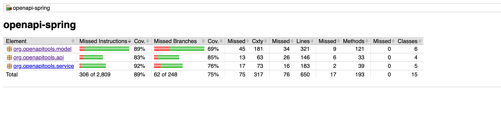
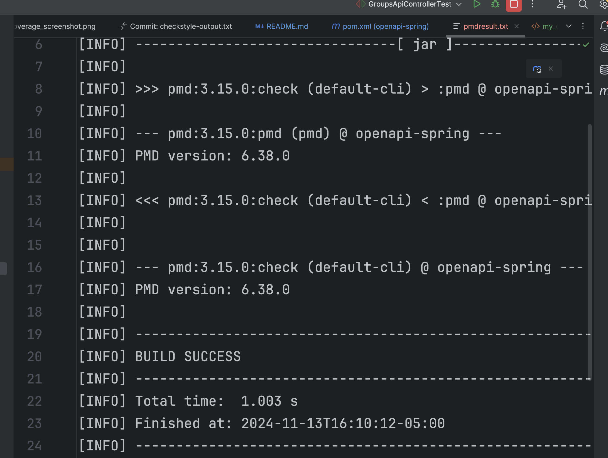
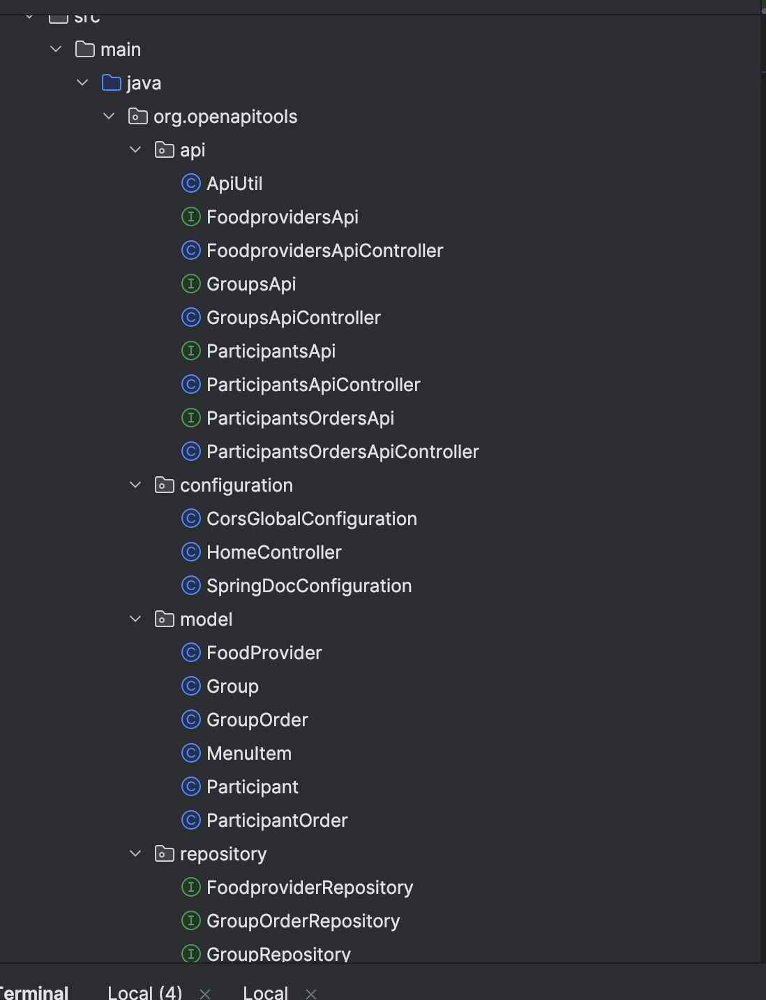
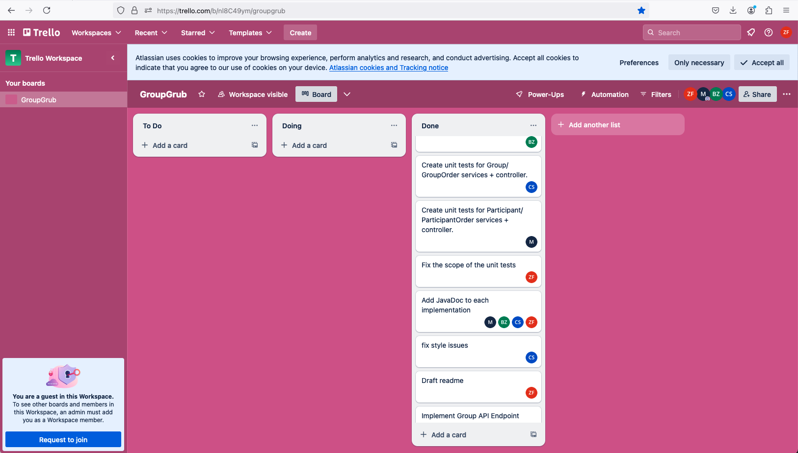

# COMSW4156 Project - GroupGrub

This is the GitHub repository for the service portion of the Project associated with COMS 4156 Advanced Software Engineering. Our team ByteBuilders (Name: Zhengwen Fu, UNI: zf2314 | Name: Marian Abuhazi, UNI: ma4107 | Name: Beijia Zhang, UNI: bz2527 | Name: Chunyu Sui, UNI: cs4480) contributed to all the requirements individually.

## Viewing the Service Repository
Please use the following link to view the repository relevant to the service: https://github.com/capsfly556/ase-4156project

## Building and Running a Local Instance
In order to build and use this service you must install the following (This guide assumes Mac but the Maven README has instructions for both Windows and Mac):

1. Maven 3.9.9: https://maven.apache.org/download.cgi Download and follow the installation instructions, be sure to set the bin as described in Maven's README as a new path variable by editing the system variables if you are on windows or by following the instructions for MacOS.
2. OpenJDK 22: This project used OpenJDK 22 for development so that is what We recommend you use: https://formulae.brew.sh/formula/openjdk
3. IntelliJ IDE: We recommend using IntelliJ but you are free to use any other IDE that you are comfortable with: https://www.jetbrains.com/idea/download/?section=mac
4. When you open IntelliJ you have the option to clone from a GitHub repo, click the green code button and copy the http line that is provided there and give it to your IDE to clone.
5. To set up the database credentials (which is mandatory for running this project), if you are running it in terminal, source a script of this format:
```
#!/bin/bash

export GROUPGRUB_DB_URL=jdbc:mysql://{$YOUR_DB_IP}:3306/{$YOUR_DB_NAME}
export GROUPGRUB_DB_USER={$YOUR_DB_USER}
export GROUPGRUB_DB_PASSWORD={$YOUR_DB_PASSWORD}
```
Also, add these environment variables in IntelliJ run configuration.
6. `cd` to the repository folder in Terminal. In order to set up the project with maven you can run <code>mvn clean install</code> and then you can either run the tests via the test files described below or the main application by running <code>GroupgrubserviceApplication.java</code> from your IDE. You can use <code>mvn clean package</code> to package the project too.
7. If you wish to run the style checker you can with <code>mvn checkstyle:check</code> or <code>mvn checkstyle:checkstyle</code> if you wish to generate the report.

## Running Tests
The unit tests are located under the directory <code>src/test</code>. To run the project's tests in IntelliJ using Java 22, you must first build the project.

From there, you can right-click any of the classes present in the src/test directory and click run to see the results.

## mvn checkstyle:check
You can run the command mvn checkstyle:check > checkstyle-output.txt to verify if the repository adheres to Google's Java style guide. In this case, the check passed successfully with no violations or warnings.


## Endpoints
This section describes the endpoints that the service provides, as well as their inputs and outputs.

### Participants

#### GET /participants
* **Expected Input Parameters:** N/A
* **Expected Output:** A JSON array containing all participants.
* **Description:** Retrieves all participants registered in the service.
* **Upon Success:** HTTP 200 Status Code is returned along with the participants list in the response body.
* **Upon Failure:** 
  * HTTP 404 Status Code with "No participants found" in the response body.

#### POST /participants
* **Expected Input Parameters:** A JSON object containing participant details.
* **Expected Output:** A JSON object containing the added participant's details.
* **Description:** Adds a new participant.
* **Upon Success:** HTTP 201 Status Code is returned along with the participant details in the response body.
* **Upon Failure:** 
  * HTTP 400 Status Code with "Failed to add participant" in the response body.

#### GET /participants/{participantID}
* **Expected Input Parameters:** participantID (String)
* **Expected Output:** A JSON object containing the details of the specified participant.
* **Description:** Retrieves details of a participant by participantID.
* **Upon Success:** HTTP 200 Status Code is returned along with the participant details in the response body.
* **Upon Failure:** 
  * HTTP 404 Status Code with "Participant not found" in the response body.

#### PUT /participants/{participantID}
* **Expected Input Parameters:** participantID (String), A JSON object containing participant details.
* **Expected Output:** A JSON object containing the updated participant's details.
* **Description:** Updates a participant's details.
* **Upon Success:** HTTP 200 Status Code is returned along with the updated participant details in the response body.
* **Upon Failure:** 
  * HTTP 400 Status Code with "Failed to update participant" in the response body.
  * HTTP 404 Status Code with "Participant not found" in the response body.

#### DELETE /participants/{participantID}
* **Expected Input Parameters:** participantID (String)
* **Expected Output:** N/A
* **Description:** Deletes a participant.
* **Upon Success:** HTTP 204 Status Code is returned.
* **Upon Failure:** 
  * HTTP 404 Status Code with "Participant not found" in the response body.

#### GET /participants/{participantID}/orders
* **Expected Input Parameters:** participantID (String)
* **Expected Output:** A JSON array containing all orders for the specified participant.
* **Description:** Retrieves all participant orders for a specific participant.
* **Upon Success:** HTTP 200 Status Code is returned along with the participant orders in the response body.
* **Upon Failure:** 
  * HTTP 404 Status Code with "No participant orders found" in the response body.

#### POST /participants/{participantID}/orders
* **Expected Input Parameters:** participantID (String), A JSON object containing participant order details.
* **Expected Output:** A JSON object containing the added participant's order details.
* **Description:** Creates a new participant order.
* **Upon Success:** HTTP 201 Status Code is returned along with the participant order details in the response body.
* **Upon Failure:** 
  * HTTP 400 Status Code with "Failed to create a new order" in the response body.

#### GET /participants/{participantID}/orders/{participantOrderID}
* **Expected Input Parameters:** participantID (String), participantOrderID (String)
* **Expected Output:** A JSON object containing the details of the specified participant's order.
* **Description:** Retrieves a specific participant's order.
* **Upon Success:** HTTP 200 Status Code is returned along with the participant order details in the response body.
* **Upon Failure:** 
  * HTTP 404 Status Code with "Order not found" in the response body.

#### PUT /participants/{participantID}/orders/{participantOrderID}
* **Expected Input Parameters:** participantID (String), participantOrderID (String), A JSON object containing participant order details.
* **Expected Output:** A JSON object containing the updated participant's order details.
* **Description:** Updates a participant's order.
* **Upon Success:** HTTP 200 Status Code is returned along with the updated participant order details in the response body.
* **Upon Failure:** 
  * HTTP 400 Status Code with "Failed to update order" in the response body.
  * HTTP 404 Status Code with "Order not found" in the response body.

#### DELETE /participants/{participantID}/orders/{participantOrderID}
* **Expected Input Parameters:** participantID (String), participantOrderID (String)
* **Expected Output:** N/A
* **Description:** Deletes a participant's order.
* **Upon Success:** HTTP 204 Status Code is returned.
* **Upon Failure:** 
  * HTTP 404 Status Code with "Order not found" in the response body.

### Groups

#### GET /groups/getAllGroups
* **Expected Input Parameters:** N/A
* **Expected Output:** A JSON array containing all groups.
* **Description:** Retrieves a list of all groups in the service.
* **Upon Success:** HTTP 200 Status Code is returned along with the groups list in the response body.
* **Upon Failure:** 
  * HTTP 404 Status Code with "No groups found" in the response body.

#### POST /groups
* **Expected Input Parameters:** A JSON object containing group details.
* **Expected Output:** A JSON object containing the added group's details.
* **Description:** Adds a new group to the service.
* **Upon Success:** HTTP 201 Status Code is returned along with the group details in the response body.
* **Upon Failure:** 
  * HTTP 400 Status Code with "Failed to add a new group" in the response body.

#### GET /groups/{groupId}
* **Expected Input Parameters:** groupId (String)
* **Expected Output:** A JSON object containing the details of the specified group.
* **Description:** Retrieves details of a specific group.
* **Upon Success:** HTTP 200 Status Code is returned along with the group details in the response body.
* **Upon Failure:** 
  * HTTP 404 Status Code with "Group not found" in the response body.

#### PUT /groups/{groupId}
* **Expected Input Parameters:** groupId (String), A JSON object containing group details.
* **Expected Output:** A JSON object containing the updated group's details.
* **Description:** Updates a group's details.
* **Upon Success:** HTTP 200 Status Code is returned along with the updated group details in the response body.
* **Upon Failure:** 
  * HTTP 404 Status Code with "Group not found" in the response body.

#### DELETE /groups/{groupId}
* **Expected Input Parameters:** groupId (String)
* **Expected Output:** N/A
* **Description:** Deletes a group.
* **Upon Success:** HTTP 204 Status Code is returned.
* **Upon Failure:** 
  * HTTP 404 Status Code with "Group not found" in the response body.

#### GET /groups/{groupId}/orders
* **Expected Input Parameters:** groupId (String)
* **Expected Output:** A JSON array containing all orders for the specified group.
* **Description:** Retrieves all group orders for a specific group.
* **Upon Success:** HTTP 200 Status Code is returned along with the group orders in the response body.

#### POST /groups/{groupId}/orders
* **Expected Input Parameters:** groupId (String), A JSON object containing group order details.
* **Expected Output:** A JSON object containing the added group's order details.
* **Description:** Creates a new group order.
* **Upon Success:** HTTP 201 Status Code is returned along with the group order details in the response body.

#### GET /groups/{groupId}/orders/{orderId}
* **Expected Input Parameters:** groupId (String), orderId (String)
* **Expected Output:** A JSON object containing the details of the specified group order.
* **Description:** Retrieves details of a specific group order.
* **Upon Success:** HTTP 200 Status Code is returned along with the group order details in the response body.
* **Upon Failure:** 
  * HTTP 404 Status Code with "Group order not found" in the response body.

#### PUT /groups/{groupId}/orders/{orderId}
* **Expected Input Parameters:** groupId (String), orderId (String), A JSON object containing group order details.
* **Expected Output:** A JSON object containing the updated group order's details.
* **Description:** Updates a group order.
* **Upon Success:** HTTP 200 Status Code is returned along with the updated group order details in the response body.
* **Upon Failure:** 
  * HTTP 400 Status Code with "Failed to update the group order" in the response body.

#### DELETE /groups/{groupId}/orders/{orderId}
* **Expected Input Parameters:** groupId (String), orderId (String)
* **Expected Output:** N/A
* **Description:** Deletes a group order.
* **Upon Success:** HTTP 204 Status Code is returned.
* **Upon Failure:** 
  * HTTP 404 Status Code with "Group order not found" in the response body.

### Food Providers

#### GET /foodproviders
* **Expected Input Parameters:** N/A
* **Expected Output:** A JSON array containing all food providers.
* **Description:** Retrieves a list of all food providers.
* **Upon Success:** HTTP 200 Status Code is returned along with the food providers list in the response body.
* **Upon Failure:** 
  * HTTP 404 Status Code with "No food providers found" in the response body.

#### POST /foodproviders
* **Expected Input Parameters:** A JSON object containing food provider details.
* **Expected Output:** A JSON object containing the added food provider's details.
* **Description:** Adds a new food provider to the service.
* **Upon Success:** HTTP 201 Status Code is returned along with the food provider details in the response body.
* **Upon Failure:** 
  * HTTP 400 Status Code with "Failed to add food provider" in the response body.

#### GET /foodproviders/{foodProviderId}
* **Expected Input Parameters:** foodProviderId (String)
* **Expected Output:** A JSON object containing the details of the specified food provider.
* **Description:** Retrieves details of a specific food provider.
* **Upon Success:** HTTP 200 Status Code is returned along with the food provider details in the response body.
* **Upon Failure:** 
  * HTTP 404 Status Code with "Food provider not found" in the response body.

#### PUT /foodproviders/{foodProviderId}
* **Expected Input Parameters:** foodProviderId (String), A JSON object containing food provider details.
* **Expected Output:** A JSON object containing the updated food provider's details.
* **Description:** Updates a food provider's details.
* **Upon Success:** HTTP 200 Status Code is returned along with the updated food provider details in the response body.
* **Upon Failure:** 
  * HTTP 400 Status Code with "Failed to update food provider" in the response body.
  * HTTP 404 Status Code with "Food provider not found" in the response body.

#### DELETE /foodproviders/{foodProviderId}
* **Expected Input Parameters:** foodProviderId (String)
* **Expected Output:** N/A
* **Description:** Deletes a food provider.
* **Upon Success:** HTTP 204 Status Code is returned.
* **Upon Failure:** 
  * HTTP 404 Status Code with "Food provider not found" in the response body.

## Style Checking Report
We used the tool "checkstyle" to check the style of the code and generate style checking reports. Here is the report as of the day of 2024/10/16 (these can be found in the images folder):





## Branch Coverage Reporting

We used JaCoCo to perform branch analysis in order to see the branch coverage of the relevant code within the code base. See below for screenshots demonstrating output.



# Static Analysis result

We used PMD as our static analysis tool and fixed all detected issues. You can run the following command to view the results

```
mvn pmd:check > pmdresult.txt
```

A screenshot of the results is also attached.





# End-to-End Testing Document

This document outlines comprehensive end-to-end tests for validating the `FoodProvider`, `Group`, `Participant`, and `ParticipantOrder` APIs. Each section includes detailed test cases with sample input data, expected outputs, and manual testing instructions.

## Test Environment

- **Testing Tools**: Recommended tools include Postman, Curl, or other REST clients.
- **Base URL**: Assuming the application is hosted at `http://localhost:8080/api`.
- **Data Preparation**: In cases where IDs are not predefined, generate random UUIDs for testing.

## Table of Contents

- [FoodProvider CRUD Operations](#foodprovider-crud-operations)
- [Group CRUD Operations](#group-crud-operations)
- [Participant CRUD Operations](#participant-crud-operations)
- [ParticipantOrder CRUD Operations](#participantorder-crud-operations)
- [Manual Testing Checklist](#manual-testing-checklist)

---

### FoodProvider CRUD Operations

This section covers creating, retrieving, updating, and deleting `FoodProvider` entities, simulating common scenarios and edge cases.

#### Add a New FoodProvider (Success)

- **Objective**: Ensure that a valid `FoodProvider` can be created successfully.
- **Request**:
  - **Method**: `POST`
  - **URL**: `/foodproviders`
  - **Body**:
    ```json
    {
      "name": "TestFoodProvider",
      "phoneNumber": "1234567890",
      "hoursOfOperation": "8hours",
      "location": "San Francisco",
      "menu": [
        {
          "name": "Burger",
          "image": "https://news.bk.com/media-assets/menu-item-and-campaign-images",
          "description": "A delicious beef burger",
          "cost": 11.00
        },
        {
          "name": "Fried chicken",
          "image": "https://www.allrecipes.com/recipe/8805/crispy-fried-chicken/",
          "description": "Crispy golden fried chicken",
          "cost": 11.00
        }
      ]
    }
    ```
- **Expected Result**:
  - **Status Code**: `201 Created`
  - **Response**: No response body expected.
  - **Behavior**: The `FoodProvider` is successfully created with the provided menu items.

#### Add FoodProvider with Missing Menu (Failure)

- **Objective**: Validate that creating a `FoodProvider` without required fields fails.
- **Request**:
  - **Method**: `POST`
  - **URL**: `/foodproviders`
  - **Body**:
    ```json
    {
      "name": "Test Provider",
      "phoneNumber": "1234567890"
    }
    ```
- **Expected Result**:
  - **Status Code**: `400 Bad Request`
  - **Response Message**: Should specify the missing `menu` field.
  - **Behavior**: The server rejects the request due to missing required fields.

#### Delete FoodProvider (Success)

- **Objective**: Verify that an existing `FoodProvider` can be deleted by its ID.
- **Request**:
  - **Method**: `DELETE`
  - **URL**: `/foodproviders/{foodProviderId}`
  - **Path Parameter**: `foodProviderId` with an existing ID, e.g., `123e4567-e89b-12d3-a456-426614174000`.
- **Expected Result**:
  - **Status Code**: `204 No Content`
  - **Response**: No response body expected.
  - **Behavior**: The `FoodProvider` is deleted from the system, and subsequent retrieval attempts should return `404 Not Found`.

#### Retrieve FoodProvider by ID (Success)

- **Objective**: Confirm that retrieving a `FoodProvider` by ID returns the correct data.
- **Request**:
  - **Method**: `GET`
  - **URL**: `/foodproviders/{foodProviderId}`
  - **Path Parameter**: `foodProviderId` with a valid ID.
- **Expected Result**:
  - **Status Code**: `200 OK`
  - **Response**:
    ```json
    {
      "name": "TestFoodProvider",
      "phoneNumber": "1234567890",
      "hoursOfOperation": "8hours",
      "location": "San Francisco",
      "menu": [
        {
          "name": "Burger",
          "description": "A delicious beef burger",
          "cost": 11.00
        },
        {
          "name": "Fried chicken",
          "description": "Crispy golden fried chicken",
          "cost": 11.00
        }
      ]
    }
    ```
  - **Behavior**: The server returns the `FoodProvider` details accurately, including the associated menu.

---

### Group CRUD Operations

#### Retrieve All Groups (Success)

- **Objective**: Verify that retrieving all groups returns a list of `Group` entries.
- **Request**:
  - **Method**: `GET`
  - **URL**: `/groups`
- **Expected Result**:
  - **Status Code**: `200 OK`
  - **Response**: A list of all existing groups.
- **Behavior**: The server should return a list of all `Group` objects. If no groups are present, it should respond with an empty list.

#### Retrieve Group by ID (Not Found)

- **Objective**: Validate that attempting to retrieve a non-existent group returns a `404 Not Found`.
- **Request**:
  - **Method**: `GET`
  - **URL**: `/groups/{groupId}`
  - **Path Parameter**: `groupId` with a non-existent ID.
- **Expected Result**:
  - **Status Code**: `404 Not Found`
  - **Response**: No response body expected.
  - **Behavior**: The server should return `404 Not Found` when the specified group ID does not exist.

---

### Participant CRUD Operations

#### Add Participant (Success)

- **Objective**: Ensure that a new `Participant` can be added.
- **Request**:
  - **Method**: `POST`
  - **URL**: `/participants`
  - **Body**:
    ```json
    {
      "name": "John Doe",
      "participantID": "123e4567-e89b-12d3-a456-426614174001"
    }
    ```
- **Expected Result**:
  - **Status Code**: `201 Created`
  - **Response**: The created `Participant` object.
- **Behavior**: The `Participant` should be added to the database and returned in the response.

#### Retrieve All Participants (Not Found)

- **Objective**: Verify that retrieving participants when none exist returns `404 Not Found`.
- **Request**:
  - **Method**: `GET`
  - **URL**: `/participants`
- **Expected Result**:
  - **Status Code**: `404 Not Found`
  - **Response**: Empty response body.
- **Behavior**: The server should return `404` if no `Participant` records are found.

---

### ParticipantOrder CRUD Operations

#### Retrieve All Orders for a Participant (Success)

- **Objective**: Ensure that all orders for a specific participant can be retrieved.
- **Request**:
  - **Method**: `GET`
  - **URL**: `/participants/{participantId}/orders`
  - **Path Parameter**: `participantId` with an existing ID.
- **Expected Result**:
  - **Status Code**: `200 OK`
  - **Response**: List of `ParticipantOrder` entries.
- **Behavior**: The server should return a list of all orders associated with the participant.

#### Update Participant Order (Success)

- **Objective**: Confirm that a participant’s order can be updated.
- **Request**:
  - **Method**: `PUT`
  - **URL**: `/participants/{participantId}/orders/{orderId}`
  - **Path Parameters**: `participantId` and `orderId` with valid IDs.
  - **Body**:
    ```json
    {
      "comments": "Updated comments",
      "menuItemIDs": {}
    }
    ```
- **Expected Result**:
  - **Status Code**: `200 OK`
  - **Response**: Updated order details.
- **Behavior**: The server updates the specified order and returns the updated information.

---


Certainly! Here’s a combined document explaining how `Mock` and `Mockito` are used in the provided unit tests:

---


# Unit Testing with Mocking in `FoodProvider` API

This document details how mocking is applied in the unit tests for the `FoodProvider` API, using `Mock` and `Mockito` to simulate the behavior of service layer components. Mocking helps isolate the logic being tested by creating controllable test environments without relying on external dependencies.


## Mocking in the Tests

In the provided unit tests, `@Mock` and `Mockito` are used to simulate the behavior of service classes such as `FoodproviderService`, `GroupService`, and `GroupOrderService`. This approach allows for focused testing on the controller logic without depending on actual implementations of these services.


## Grouping of Testing Files

Our source files are organized into groups based on their roles: API, service, model, and repository. Similarly, our test files are grouped according to these same categories: API, service, model, and repository. This structure helps maintain consistency and makes it easy to locate and manage related files.





### Use mocking in our test files

1. **Creating Mocks with `@Mock` Annotation**:
   ```java
   @Mock
   private FoodproviderService service;
   ```
   The `@Mock` annotation creates a mock instance of `FoodproviderService`, rather than using a real service instance. This allows for complete control over the behavior of `FoodproviderService` during the test, without relying on a database or any other external service.

2. **Specifying Mock Behavior with `Mockito.when`**:
   ```java
   Mockito.when(service.addFoodProvider(Mockito.any(FoodProvider.class)))
           .thenReturn(true);
   ```
   The `Mockito.when` method specifies that when `service.addFoodProvider()` is called with any `FoodProvider` object, it should return `true`. This approach enables the test to simulate the expected behavior of the `addFoodProvider` method, ensuring predictable test outcomes and avoiding side effects from real service interactions.

3. **Verifying Method Calls with `Mockito.verify`**:
   ```java
   Mockito.verify(service, Mockito.times(1)).addFoodProvider(Mockito.any(FoodProvider.class));
   ```
   The `Mockito.verify` method is used to check whether `addFoodProvider` was called exactly once during the test. This verification ensures that the expected service method is called as part of the controller logic, allowing for further validation of the controller's behavior.


### Manual Testing Checklist

If automation is unavailable, follow these steps manually:

1. **Set Up Initial Data**: Ensure all entities (`FoodProvider`, `Group`, `Participant`, and `ParticipantOrder`) are created or available as needed.

2. **Verify API Response Codes and Content**: Use tools like Postman to send API requests for each endpoint. Compare the actual responses against the expected results documented above.

3. **Log Each Result**: Record whether each test passed or failed, noting discrepancies.

4. **Repeat Tests as Needed**: Re-run tests as the application evolves to ensure consistency.


## Project management

We used the tool Trello for the project management. Here is the screenshot of the board:



## Third-party code
The initial project skeleton is generated using [openapi-generator](https://github.com/OpenAPITools/openapi-generator) with the OpenAPI specs wrote by our team. Specifically, <code>in src/main/java/org/openapitools</code>, the <code>api/\*Api.\*</code> files, the <code>api/ApiUtil.java</code> file, the <code>configuration/\*</code> files, the <code>GroupgrubserviceApplication.java</code> file, and the <code>RFC3339DateFormat.java</code> file are auto-generated and are excluded from the test report.

## Tools used
This section includes notes on tools and technologies used in building this project, as well as any additional details if applicable.

* Maven Package Manager
* Checkstyle
  * We use Checkstyle for code reporting. Note that Checkstyle does NOT get run as part of the CI pipeline.
  * For running Checkstyle manually, you can use the "Checkstyle-IDEA" plugin for IntelliJ.
* JUnit
  * JUnit tests get run automatically as part of the CI pipeline.
* JaCoCo
  * We use JaCoCo for generating code coverage reports.
* openapi-generator
  * We use openapi-generator for the initial project skeleton.
* Trello
  * We use Trello for the project management.


